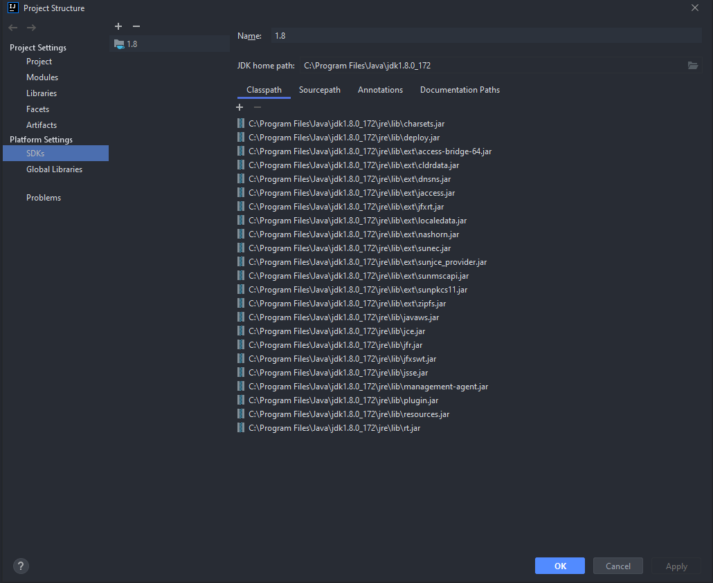
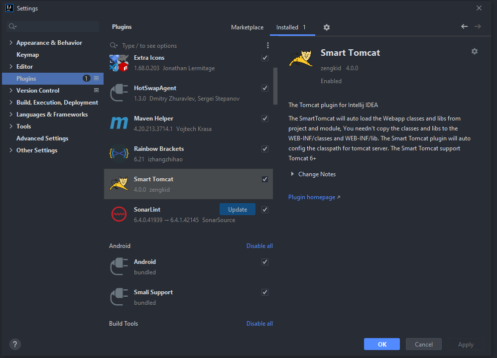
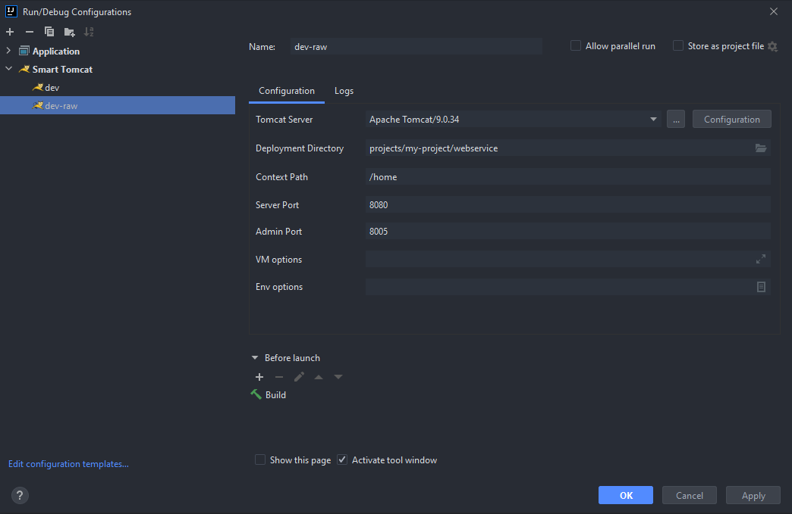
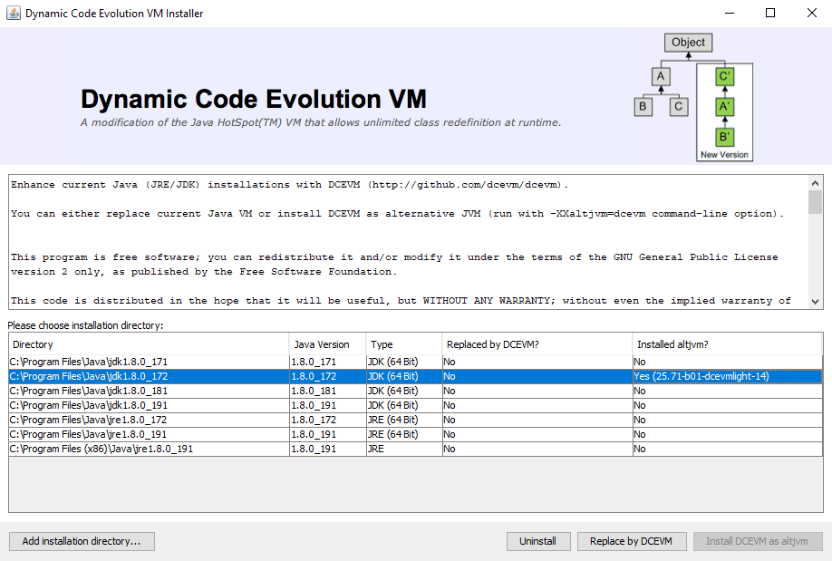
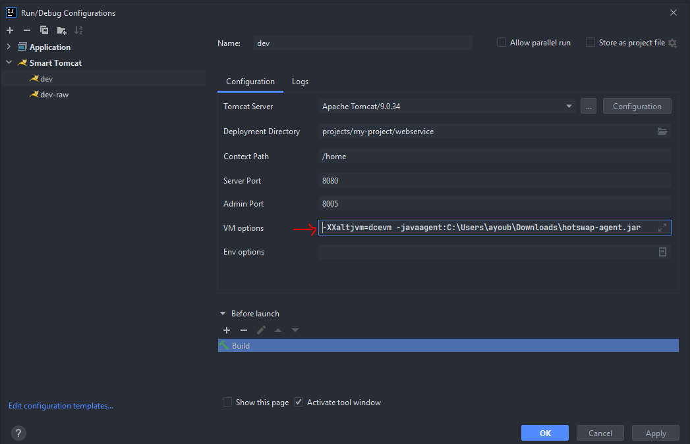

# Java configuration
    File > Project Structure > Platforms Settings > SDKs

## JDK download links
> https://repo.huaweicloud.com/java/jdk/

  

# Tomcat plugin Installation
> **Plugin name:** Smart Tomcat

    File > Settings > Plugins

# Smart Tomcat configuration

## Tomcat download links
> https://tomcat.apache.org/download-90.cgi

  

# Hot-deploy configuration (HotswapAgent)

> More info : https://github.com/HotswapProjects/HotswapAgent/blob/master/README.md

  

## DCEVM installation (Dynamic Code Evolution VM)

> DCEVM is an extension to the JVM that allow to reload classes at runtime more easily. 
> More info : http://dcevm.github.io/

 

### **DCEVM Download links**
> You need to use an installer compatible with your JDK version

> For Java 8 : https://github.com/dcevm/dcevm/releases

> For Java 11 : https://github.com/TravaOpenJDK/trava-jdk-11-dcevm/releases

### **Installation steps**

1) Run CMD as administrator
2) Launch `java -jar java -jar DCEVM-installer.jar`
3) Chose the compatible JDK with you installer and click on **"Install DCEVM as altjvm"**

## HotswapAgent installation

### **HotswapAgent Download link**
> https://github.com/HotswapProjects/HotswapAgent/releases

Download hotswap-agent.jar and put in a simple path, for exemple : `C:\java\hotswap-agent.jar`

### **Enable automatic Hotswap after compile on IntelliJ**

    File > Settings > Build, Execution, Deployment > HotSwap

### **Change Compile Build shortcut to *CTRL+S***

    File > Settings > Keymap > Main Menu > Build

### **Tomcat Hotswap configuration**

Add to VM options : `-XXaltjvm=dcevm -javaagent:c:\java\hotswap-agent.jar`

> To disable a hotsawp plugin (Exemple : Hibernate) :  
`-XXaltjvm=dcevm -javaagent:c:\java\hotswap-agentjar=disablePlugin=Hibernate`

 

### **Launch application with debug mode** (CTRL+S to hot-deploy)
